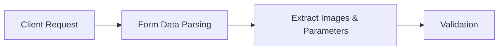

# Mobile Exam Questions API Documentation

## Endpoint: `/api/mobile/exam-questions`

### Overview
The Mobile Exam Questions endpoint is a core API for the ExamGenie MVP mobile application. It processes images of educational content (primarily Swedish textbooks) and generates Finnish language exam questions using Google's Gemini 2.5 Flash-Lite AI model. This endpoint supports multi-user architecture with optional authentication and provides subject-aware exam generation.

---

## Request Details

### HTTP Method
`POST`

### Headers
| Header | Required | Description |
|--------|----------|-------------|
| `Content-Type` | Yes | Must be `multipart/form-data` |
| `Authorization` | No | Optional JWT token: `Bearer <token>` |

### CORS Support
- **Allowed Origins**: `*` (all origins)
- **Allowed Methods**: `POST`, `OPTIONS`
- **Allowed Headers**: `Content-Type`, `Authorization`
- Preflight requests handled via `OPTIONS` method

---

## Request Parameters

### Form Data Fields

| Field | Type | Required | Description | Validation |
|-------|------|----------|-------------|------------|
| `images` | File[] | Yes | Image files to process | • Max 20 files<br>• Max 10MB per file<br>• Formats: JPEG, PNG, WebP, HEIC |
| `prompt` | string | No | Custom prompt for AI processing | Any text string |
| `category` | string | No | Question category type | One of: `mathematics`, `core_academics`, `language_studies` |
| `subject` | string | No | Finnish subject (legacy) | Valid Finnish subject from predefined list |
| `grade` | integer | No | Student grade level | Number between 1-9 |
| `user_id` | string | No | User identifier | UUID format |
| `student_id` | string | No | (Deprecated) Use `user_id` instead | UUID format |
| `language` | string | No | Output language | Default: `en` |

### Category vs Subject
- **Category** (preferred): High-level grouping for question generation
  - `mathematics`: Math-related questions
  - `core_academics`: Science, history, geography
  - `language_studies`: Language and literature
- **Subject** (legacy): Specific Finnish subjects for backwards compatibility
  - Only used if `category` is not provided
  - Must be from `FINNISH_SUBJECTS` enum

### Supported Finnish Subjects
```typescript
FINNISH_SUBJECTS = [
  'matematiikka',      // Mathematics
  'fysiikka',          // Physics
  'kemia',             // Chemistry
  'biologia',          // Biology
  'maantiede',         // Geography
  'historia',          // History
  'yhteiskuntaoppi',   // Social Studies
  'äidinkieli',        // Finnish Language
  'englanti',          // English
  'ruotsi',            // Swedish
  'saksa',             // German
  'ranska',            // French
  'espanja',           // Spanish
  'musiikki',          // Music
  'kuvataide',         // Visual Arts
  'liikunta',          // Physical Education
  'kotitalous',        // Home Economics
  'käsityö',           // Crafts
  'uskonto',           // Religion
  'elämänkatsomustieto', // Ethics
  'psykologia',        // Psychology
  'filosofia',         // Philosophy
  'terveystieto'       // Health Education
]
```

---

## Response Format

### Success Response (200 OK)

```json
{
  "success": true,
  "data": {
    "extractedText": "Full OCR extracted text from images...",
    "questions": [
      {
        "id": "q_1",
        "type": "multiple_choice",
        "question": "Mikä on Pythagoraan lauseen kaava?",
        "options": [
          "a² + b² = c²",
          "a² - b² = c²",
          "a² × b² = c²",
          "a² ÷ b² = c²"
        ],
        "correctAnswer": 0,
        "explanation": "Pythagoraan lause kertoo, että...",
        "difficulty": "medium",
        "topic": "geometry",
        "points": 2
      },
      {
        "id": "q_2",
        "type": "short_answer",
        "question": "Selitä lyhyesti mitä tarkoittaa fotosynteesi?",
        "correctAnswer": "Fotosyn  teesi on prosessi, jossa...",
        "explanation": "Tässä prosessissa kasvit...",
        "difficulty": "easy",
        "topic": "biology",
        "points": 3
      },
      {
        "id": "q_3",
        "type": "true_false",
        "question": "Ruotsi on Suomen virallinen kieli?",
        "correctAnswer": true,
        "explanation": "Suomessa on kaksi virallista kieltä...",
        "difficulty": "easy",
        "topic": "social_studies",
        "points": 1
      }
    ],
    "metadata": {
      "totalQuestions": 10,
      "difficulty": {
        "easy": 3,
        "medium": 5,
        "hard": 2
      },
      "questionTypes": {
        "multiple_choice": 5,
        "short_answer": 3,
        "true_false": 2
      },
      "estimatedTime": 45,
      "totalPoints": 20,
      "subject": "matematiikka",
      "grade": 7,
      "language": "fi",
      "sourceLanguage": "sv",
      "processingTime": 3456,
      "tokenUsage": {
        "input": 15234,
        "output": 2456,
        "total": 17690,
        "cost": 0.0234
      }
    }
  },
  "examData": {
    "examUrl": "https://app.example.com/exam/abc123-def456",
    "examId": "abc123-def456-789012",
    "gradingUrl": "https://app.example.com/grading/abc123-def456"
  },
  "requestMetadata": {
    "requestId": "req_xyz789",
    "processingTime": 3456
  }
}
```

### Error Responses

#### Validation Error (400 Bad Request)
```json
{
  "success": false,
  "error": {
    "message": "Invalid category. Must be one of: mathematics, core_academics, language_studies",
    "details": "Category determines the type of exam questions to generate.",
    "code": "VALIDATION_ERROR",
    "requestId": "req_xyz789"
  }
}
```

#### File Error (400 Bad Request)
```json
{
  "success": false,
  "error": {
    "message": "File too large. Maximum file size is 10MB",
    "details": "The file 'textbook-page-5.jpg' exceeds the maximum allowed size",
    "code": "FILE_TOO_LARGE",
    "requestId": "req_xyz789"
  }
}
```

#### Authentication Error (401 Unauthorized)
```json
{
  "success": false,
  "error": {
    "message": "Invalid or expired token",
    "code": "AUTH_ERROR"
  }
}
```

#### Internal Server Error (500)
```json
{
  "success": false,
  "error": {
    "message": "An unexpected error occurred. Please try again.",
    "details": "Internal processing error",
    "code": "INTERNAL_ERROR",
    "requestId": "req_xyz789"
  }
}
```

---

## Processing Flow

### 1. Request Reception


### 2. Validation Steps
- **Image Validation**:
  - File count: 1-20 images
  - File size: Max 10MB per image
  - File type: JPEG, PNG, WebP, HEIC
- **Parameter Validation**:
  - Category: Must be valid if provided
  - Subject: Must be valid Finnish subject if provided (and no category)
  - Grade: Integer 1-9 if provided
  - Student ID: Valid UUID format if provided

### 3. Processing Pipeline
```typescript
1. Generate Processing ID (UUID)
2. Log request details
3. Validate authentication (optional)
4. Process images through MobileApiService
   - Convert images to base64
   - Send to Gemini API
   - Extract text via OCR
   - Generate exam questions
5. Store exam in database (if authenticated)
6. Return results with exam URLs
```

### 4. Gemini AI Integration
- **Model**: Gemini 2.5 Flash-Lite (gemini-2.0-flash-exp)
- **Temperature**: 0.3 (for consistent output)
- **Max Tokens**: 8192
- **Retry Logic**: Exponential backoff for 503 errors
- **Cost Tracking**: Per-request token usage and pricing

---

## Implementation Details

### File Location
`/src/app/api/mobile/exam-questions/route.ts`

### Key Dependencies
```typescript
import { MobileApiService } from '@/lib/services/mobile-api-service'
import { withOptionalAuth } from '@/middleware/auth'
import { RequestProcessor } from '@/lib/middleware/request-processor'
import { ApiResponseBuilder } from '@/lib/utils/api-response'
import { ErrorManager } from '@/lib/utils/error-manager'
```

### Service Layer Architecture
The endpoint delegates core processing to `MobileApiService`, which handles:
- Image processing and base64 conversion
- Gemini API communication
- Question generation logic
- Cost calculation
- Error recovery

### Error Handling
- **Centralized Error Management**: All errors go through `ErrorManager`
- **User-Friendly Messages**: Technical errors converted to readable messages
- **Request Tracking**: Unique `requestId` for debugging
- **Detailed Logging**: Console logs for troubleshooting

---

## Usage Examples

### JavaScript/TypeScript (Fetch API)
```javascript
const formData = new FormData();

// Add images
formData.append('images', imageFile1);
formData.append('images', imageFile2);

// Add parameters
formData.append('category', 'mathematics');
formData.append('grade', '7');
formData.append('language', 'fi');
formData.append('prompt', 'Generate algebra questions');

const response = await fetch('https://api.example.com/api/mobile/exam-questions', {
  method: 'POST',
  body: formData,
  headers: {
    'Authorization': 'Bearer YOUR_JWT_TOKEN' // Optional
  }
});

const result = await response.json();
```

### Flutter/Dart
```dart
import 'package:http/http.dart' as http;
import 'dart:convert';

Future<void> generateExam() async {
  var request = http.MultipartRequest(
    'POST',
    Uri.parse('https://api.example.com/api/mobile/exam-questions'),
  );

  // Add images
  request.files.add(await http.MultipartFile.fromPath(
    'images',
    imagePath1,
  ));
  request.files.add(await http.MultipartFile.fromPath(
    'images',
    imagePath2,
  ));

  // Add fields
  request.fields['category'] = 'mathematics';
  request.fields['grade'] = '7';
  request.fields['language'] = 'fi';

  // Optional auth
  request.headers['Authorization'] = 'Bearer $token';

  var response = await request.send();
  var responseBody = await response.stream.bytesToString();
  var result = json.decode(responseBody);
}
```

### cURL
```bash
curl -X POST https://api.example.com/api/mobile/exam-questions \
  -H "Authorization: Bearer YOUR_JWT_TOKEN" \
  -F "images=@/path/to/image1.jpg" \
  -F "images=@/path/to/image2.jpg" \
  -F "category=mathematics" \
  -F "grade=7" \
  -F "language=fi" \
  -F "prompt=Focus on geometry"
```

---

## Performance Considerations

### Response Times
- **Typical**: 2-5 seconds for 1-5 images
- **Maximum**: 30 seconds for 20 images
- **Factors**: Image size, Gemini API latency, question complexity

### Rate Limits
- **Per Request**: Max 20 images, 10MB each
- **Concurrent Requests**: No hard limit (server capacity dependent)
- **Gemini API**: Subject to Google's rate limits

### Optimization Tips
1. **Image Compression**: Pre-compress images client-side
2. **Batch Processing**: Send multiple pages in one request
3. **Caching**: Results stored in memory for job retrieval
4. **Async Processing**: Non-blocking architecture

---

## Security Considerations

### Authentication
- **Optional JWT**: Enables user-specific features
- **Anonymous Access**: Allowed for basic functionality
- **Token Validation**: Via Supabase auth

### Input Validation
- **File Type Check**: MIME type validation
- **Size Limits**: Enforced at multiple levels
- **SQL Injection**: Protected via parameterized queries
- **XSS Prevention**: Input sanitization

### Data Privacy
- **Temporary Storage**: Images deleted after processing
- **No PII Logging**: Only metadata logged
- **Secure Transmission**: HTTPS required

---

## Monitoring & Debugging

### Logging
```typescript
console.log('=== MOBILE API REQUEST DETAILS ===')
console.log('Processing ID:', processingId)
console.log('Image count:', images.length)
console.log('Category:', category)
console.log('Grade:', grade)
console.log('Client IP:', clientInfo.ip)
```

### Performance Metrics
- Processing time tracked
- Token usage calculated
- Cost per request logged
- Error rates monitored

### Debug Headers
Response includes:
- `X-Request-Id`: Unique request identifier
- `X-Processing-Time`: Total processing duration
- `X-Token-Usage`: Gemini tokens consumed

---

## Migration & Deprecation Notes

### Legacy Support
- **Subject Parameter**: Maintained for backwards compatibility
- **Category Preferred**: New integrations should use `category`
- **Migration Path**: Subject → Category mapping available

### Future Enhancements
- [ ] WebSocket support for real-time updates
- [ ] Batch job queuing
- [ ] Result caching
- [ ] Multi-language question generation
- [ ] Difficulty customization

---

## Support & Troubleshooting

### Common Issues

| Issue | Cause | Solution |
|-------|-------|----------|
| 400 Error | Invalid parameters | Check category/subject values |
| 413 Error | File too large | Compress images before upload |
| 503 Error | Gemini API overload | Retry with exponential backoff |
| Empty questions | Poor image quality | Use higher resolution images |
| Wrong language | Missing language param | Specify `language: 'fi'` |

### Contact
- **GitHub Issues**: [Project Repository](https://github.com/your-repo)
- **API Status**: Check `/api/health` endpoint
- **Logs**: Available in production monitoring dashboard

---

## Appendix

### Question Types Generated

1. **Multiple Choice** (`multiple_choice`)
   - 4 options typically
   - Single correct answer
   - Explanation provided

2. **Short Answer** (`short_answer`)
   - Text response required
   - Model answer provided
   - Flexible grading

3. **True/False** (`true_false`)
   - Boolean answer
   - Explanation included
   - Quick assessment

### Difficulty Levels
- **Easy**: Basic recall, simple concepts
- **Medium**: Application, moderate complexity
- **Hard**: Analysis, synthesis, complex problems

### Topic Mapping
Topics automatically detected based on content:
- Mathematics: algebra, geometry, calculus, statistics
- Sciences: physics, chemistry, biology
- Languages: grammar, vocabulary, literature
- Social Studies: history, geography, civics

---

*Last Updated: January 2025*
*API Version: 1.0.0*